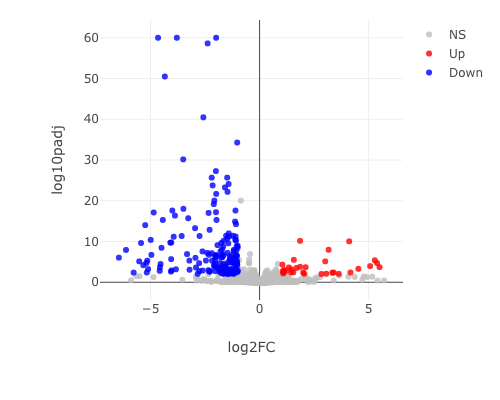
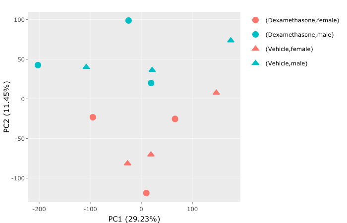
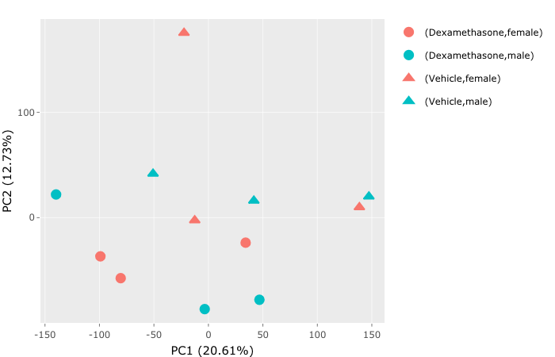

```{r setup, include=FALSE}
knitr::opts_chunk$set(echo = TRUE)
```

# Introduction

For the takehome final you will have 48 hours to complete the objectives listed below. 
The deadline for submission is Wednesday, 6 May 2020 at 2:45pm EDT.

## Date/Time started:
 
 5/4/2020

You will be graded on the following criteria:

* Completion of the objectives
* Readability (tidyness) of Rmd code
* Summary of results from differential expression analysis
* Acknowledgement of resources

## Loading Libraries

Load all of your libraries in this code block. Indicate why each library is necessary.

```{r Load Libraries, include=FALSE}
if (!require("devtools")) install.packages("devtools"); library(devtools)
# devtools is needed to load packages from github repos

if (!require("tidyverse")) install.packages("tidyverse"); library(tidyverse)
# tidyverse is needed for ggplot2, readr, and dplyr
# Always load tidyverse last so that its functions will not get masked by other packages

```

## Objectives for Final Exam

* [X] Checking downloaded data for accuracy
* [X] Manipulate metadata to produce files required to run DEBrowser
* [X] Examination of batch effect caused by sex
* [X] Determination of differential expression caused by treatment
* [X] Answering questions about best practices for data analysis

## Honor Code

By submitting this takehome final, I acknowledge that I will abide by the Bucknell University Honor Code.
As a student and citizen of the Bucknell University community:

1. I will not lie, cheat or steal in my academic endeavors.
2. I will forthrightly oppose each and every instance of academic dishonesty.
3. I will let my conscience guide my decision to communicate directly with any person or persons I believe to have been dishonest in academic work.
4. I will let my conscience guide my decision on reporting breaches of academic integrity to the appropriate faculty or deans.

## Background

RNA-Seq performed by:
Frahm KA, Waldman JK, Luthra S, Rudine AC, Monaghan-Nichols AP, Chandran UR. A comparison of the sexually dimorphic dexamethasone transcriptome in mouse cerebral cortical and hypothalamic embryonic neural stem cells. Mol Cell Endocrinol. 2017; https://doi.org/10.1016/j.mce.2017.05.026.

Abstract
Fetal exposure to synthetic glucocorticoids reprograms distinct neural circuits in the developing brain, often in a sex-specific manner, via mechanisms that remain poorly understood. To reveal whether such reprogramming is associated with select molecular signatures, we characterized the transcriptome of primary, embryonic mouse cerebral cortical and hypothalamic neural progenitor/stem cells derived from individual male and female embryos exposed to the synthetic glucocorticoid, dexamethasone. Gene expression profiling by RNA-Seq identified differential expression of common and unique genes based upon brain region, sex, and/or dexamethasone exposure. These gene expression datasets provide a unique resource that will inform future studies examining the molecular mechanisms responsible for region- and sex-specific reprogramming of the fetal brain brought about by in utero exposure to excess glucocorticoids.

Dataset download:
The full dataset is available from: https://figshare.com/articles/kallisto_quantifications_of_Frahm_et_al_2017/6203012

The raw reads are available from the Sequence Read Archive, although we will not be using them for the take-home exam:
https://www.ncbi.nlm.nih.gov/sra/SRP100701

Kallisto has already been used to quantify transcripts and we will only be analyzing the samples from the hypothalamus.

The Kallisto results have has been placed in a Zip file in the class repo in the 07-Exams directory. 
Download the file SRP100701.zip, move it to your repo, and then unzip the file. 
You can then delete the .zip file so that it will not also be pushed to your repo.

```{r Read Metadata}
sample_table <- read_tsv("SRP100701.sample_table.txt")
sample_table
```

## SARTools

The SARTools package has been developped at PF2 - Institut Pasteur by M.-A. Dillies and H. Varet. *SARTools: A DESeq2- and EdgeR-Based R Pipeline for Comprehensive Differential Analysis of RNA-Seq Data*, PLoS One, 2016, doi: http://dx.doi.org/10.1371/journal.pone.0157022

Help for SARTools can be found at https://github.com/PF2-pasteur-fr/SARTools

# Takehome Final Part 1

As a reminder, you may consult your previous homework and group projects, textbook and other readings, and online resources.
Online resources may be used to research ways to solve each problem, but you may not pose questions in online forums about the specific assignment.
You may consult with Prof. Field or with other classmates about technical problems (e.g. where to find a file), but not about how to answer any of the questions.

## (1) Data Verification

### Check the metadata

Check the gender, treatment, and tissue values in your metadata table against either the original paper or the SRA.
Verify that the file names in the kallisto results folder match run names in the metadata.

After checking (https://trace.ncbi.nlm.nih.gov/Traces/sra/?study=SRP100701), our metadata table looks good in comparison to the original. The kallisto file names 
The metadatat includes SRR5285036-SRR5285059 but we only have 48-59 so ours is just a smaller set than the metadata. 

### Check the kallisto count data

Load in at least two of the abundance.tsv files.
Look at the top and the bottom of your data. (Note which column has the estimated counts for later.)
Verify that both files have the same number of transcripts.
Confirm that there are no NAs present.

```{r}
abundance48 <- read_tsv("SRP100701/kallisto/SRR5285048/abundance.tsv")
head(abundance48)
tail(abundance48)

abundance49 <- read_tsv("SRP100701/kallisto/SRR5285049/abundance.tsv")
head(abundance49)
tail(abundance49)
```
the counts and numbers all look good and all values for est counts and tpm are 0s and other columns don't have NAs present, but the values for each differ.

## (2) Run SARTools or DEBrowser (I picked DEBrowser)

Use DESeq2 for your analysis (although you are welcome to compare the results to edgeR).
Use an FDR cutoff of 0.05 to determine differential expression (and also leave other settings in SARTools at their default values).

### Use dplyr to construct the file(s) that you need for SARTools/DEBrowser

Use SRP100701.sample_table.txt for the sample information. 
You will need to retain only the hypothalamus samples. 
Keep the sample name, sex, and treatment.
For SARTools, convert this file to a target.txt file. 
For DEBrowser, generate a metadata.tsv file and a transcripts counts tsv file.

```{r using dplyr}
hypothalamus_only <- read_tsv("SRP100701.sample_table.txt") %>%  dplyr::filter(tissue_region_s == "Hypothalamus") %>%  dplyr::select(Sample_Name_s, treatment_s, gender_s )
write_tsv(hypothalamus_only, path="hypothalamus_only.tsv")
```

### Sex-differences in transcript expression

This can be found in the DEBrowser file.

Methods used in DEBrowser:
* filter: CPM<1 in at least 3 samples
* DE analysis: condition 1 = female, condition 2 = male
* results: padj = 0.05

After running that I downloaded my plots into the folder "sex_plotsDEBrowser"

### Treatment effects on transcript expression

Then I used a batch effect to correct for sex-differences and to look for transcripts that are differentially expressed based on dexamethasone treatment.

This can be found in the DEBrowser file.

Methods used in DEBrowser:
* filter: CPM<1 in at least 3 samples
* batch correction: TMM normalization method, Combat correction method, treatment = treatment_s, batch = gender_s
* DE analysis: condition 1 = Dexamethasone, condition 2 = Vehicle
* results: padj = 0.05.

These results were then downloaded into the "treatment_plotsDEBrowser"

## (3) Summarize your differential expression analysis

Dexamethasone clearly causes differential expression. The significant up and down regulated genes are shown clearly in the volcano plot. There are 67 significantly up regulated genes and 242 significantly down regulated genes based on the Volcano plot generated.
```{r}

```
There is differential gene expression between treatment groups which is important to recognize for any further analysis.

Another important part of the analysis is batch correcting. I downloaded the PCA plots before and after the batch correction and the differences are quite notable:
```{r}



```
As you can see the pre-batch corrected version is separated by sex which is not helpful to our analysis, but after there are corrections made you can see that its determined by treatment which clearly illustrates there is a difference between the treatments.

# Takehome Final Part 2

## Q1: Comparison to previous analysis

You would like to know if your results are consistent with those described in the Frahm et al. paper. [Frahm et al.](Frahm_etal.pdf)
You do not have to carry out the comparison, but briefly describe (3-4 sentences) the process that you would need to follow to answer this (not so simple) question.

I think the best way to confirm my results with the paper's results would be to look at the names of the genes I used and then look at the genes in their data. After looking at the gene names I could figure out a way to sort by the gene names so I could see my results and the Frahm et al. results. Using r I could see the full data sets and manipulate the data sets to see specific column names and compare the results. Minor issues would likely be attributed the the pipelines used because even in our class between people there were tiny changes in reads. Larger discrepancies would likely mean they are not consistent and you need to change something, you could look at their raw data and see what steps they took and attempt to replicate with the data you have.

## Q2: Improvements to Frahm et al.

Imagine that you are reviewing a draft of this manuscript prior to submitting it for publication. 
Describe the 3 most important suggestions that would incorporate best practices in data analysis and visualization.

### Suggestion 1:

Figure 1 and 2 are pie charts, which is fine in some scenarios but in this example I think the data could be organized in a clearer graphic. Pie charts also heavily use colors and what if the reader is colorblind. Maybe that's a stretch for why you shouldn't use pie charts, but I think a bar or boxplot could clearly depict the data in an easier, and more informative way.

### Suggestion 2:

There is a lot of information which seems to never be explained, and I think it would be near impossible to attempt to replicate this paper. For example many of the sample sizes never have criteria explained for why they chose that size. And even the settings used for the mapping and DE analysis were not explained, which limits the possibility for recreating their results or even manipulating other data sets to attempt their experiment. 

### Suggestion 3:
Publish their code or put this link to the code somewhere. It's much easier to understand how the results they generated or even how they manipulated the raw data when you can also see the code. Plus this makes it much easier for anyone to recreate the analysis with slightly different data if they know the general blueprint for the analysis.  

## Q3: Research Practices

Imagine that you conducted this analysis for your Honors/Masters thesis project. 
Describe how you would handle each of the following scenarios, citing specific QRPs where appropriate.

### Scenario 1:
You are concerned that two of the samples may have been switched during sample preparation. 
What is your confidence that this did or did not occur?

If it did occur and there were no other indicators such as gender, treatment, or tissue type such as this experiment I would need to start over. That's not always possible with deadlines and finances so then I would continue my experiment and hope that if they were switched I could use my data to determine this and then make notes and exclude it from the results. I don't think this is a specific QRP, but people should be very careful and take all steps needed to not confuse samples because it could ruin the data.


### Scenario 2:
Your advisor is disappointed with the number of differentially expressed transcripts that you found in the female vs male comparison.
They suggest that you should send additional samples out for sequencing and add them to this study to increase the statistical power.

This would be p-hacking because you are looking for ways to improve your data after finding the results. If you are going through with this you would need to analyze them separately because putting the two batches together wouldn't be producing honest data.


### Scenario 3:
The transcripts that are differentially expressed between vehicle and dexamethasone treated cells does not include several that had been found in a previous study in your lab. 
Your advisor suggests re-running the analysis using the model counts ~ sex * treatment instead of the model counts ~ sex + treatment.
(Note that SARTools cannot handle GLM interactions and this would have to be done with DESeq2 in R.)

Once again a type of p-hacking. I this case I would not allow that to happen even if my advisor wanted it. The different results do not mean we need to generate data just to confirm previous results, that's not how honest science works. Run both models and include both if you write about them and suggest why errors may have occurred. Picking data or models that best suits the results you want is not helpful, nor is it honest.

## Date/Time completed:
5/5/2020

# Acknowledgements
https://debrowser.readthedocs.io/en/master/quickstart/quickstart.html

https://bioconductor.org/packages/release/bioc/vignettes/debrowser/inst/doc/DEBrowser.html

