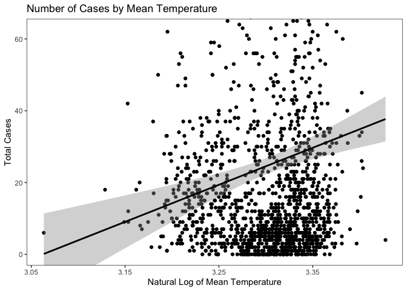

Takehome Midterm
================
Riley McDonnell
23 Mar 2020

# Introduction

For the take home midterm you will have 48 hours to complete the
objectives listed below. The deadline for submission is 18 March 2020 at
2pm EST.

Date/Time started: Sunday March 23rd 11:30 am Date/Time completed:
Monday March 24th 1:00 pm

You will be graded on the following criteria:

  - Completion of the objectives
  - Successful knitting of the pdf
  - Readability (tidyness) of Rmd code
  - Acknowledgement of resources

## Loading Libraries

Load all of your libraries in this code block. Indicate why each library
is necessary.

## Objectives for Midterm Exam

  - \[X\] Import, clean, merge data tables
  - \[ \] Present graphical summary of Dengue incidence data
  - \[ \] Data exploration of potential explanatory variables
  - \[ \] Test Benchmark model of Dengue incidence
  - \[ \] Improve model of Dengue incidence

## Background

This dataset should be familiar from Lab 6. We will be using the Dengue
dataset from a Driven Data competition:
<https://www.drivendata.org/competitions/44/dengai-predicting-disease-spread/>

The data for this competition comes from multiple sources aimed at
supporting the Predict the Next Pandemic Initiative
(<https://www.whitehouse.gov/blog/2015/06/05/back-future-using-historical-dengue-data-predict-next-epidemic>).
Dengue surveillance data is provided by the U.S. Centers for Disease
Control and prevention, as well as the Department of Defense’s Naval
Medical Research Unit 6 and the Armed Forces Health Surveillance Center,
in collaboration with the Peruvian government and U.S. universities.
Environmental and climate data is provided by the National Oceanic and
Atmospheric Administration (NOAA), an agency of the U.S. Department of
Commerce.

The data is provided in two separate files:

1.  dengue\_features\_train: weekly weather and vegetation data for two
    cities
2.  dengue\_labels\_train: weekly number of dengue cases in each city

There are two cities, San Juan, Puerto Rico and Iquitos, Peru, with test
data for each city spanning 5 and 3 years respectively. The data for
each city have been concatenated along with a city column indicating the
source: *sj* for San Juan and *iq* for
Iquitos.

``` r
dengue_features_train <- read_csv("https://s3.amazonaws.com/drivendata/data/44/public/dengue_features_train.csv")
```

    ## Parsed with column specification:
    ## cols(
    ##   .default = col_double(),
    ##   city = col_character(),
    ##   week_start_date = col_date(format = "")
    ## )

    ## See spec(...) for full column specifications.

``` r
dengue_labels_train <- read_csv("https://s3.amazonaws.com/drivendata/data/44/public/dengue_labels_train.csv")
```

    ## Parsed with column specification:
    ## cols(
    ##   city = col_character(),
    ##   year = col_double(),
    ##   weekofyear = col_double(),
    ##   total_cases = col_double()
    ## )

## Feature Descriptions

You are provided the following set of information on a (year,
weekofyear) timescale:

(Where appropriate, units are provided as a \_unit suffix on the feature
name.)

City and date indicators

  - city – City abbreviations: sj for San Juan and iq for Iquitos
  - week\_start\_date – Date given in yyyy-mm-dd format

NOAA’s GHCN daily climate data weather station measurements

  - station\_max\_temp\_c – Maximum temperature
  - station\_min\_temp\_c – Minimum temperature
  - station\_avg\_temp\_c – Average temperature
  - station\_precip\_mm – Total precipitation
  - station\_diur\_temp\_rng\_c – Diurnal temperature range

PERSIANN satellite precipitation measurements (0.25x0.25 degree scale)

  - precipitation\_amt\_mm – Total precipitation

NOAA’s NCEP Climate Forecast System Reanalysis measurements (0.5x0.5
degree scale)

  - reanalysis\_sat\_precip\_amt\_mm – Total precipitation
  - reanalysis\_dew\_point\_temp\_k – Mean dew point temperature
  - reanalysis\_air\_temp\_k – Mean air temperature
  - reanalysis\_relative\_humidity\_percent – Mean relative humidity
  - reanalysis\_specific\_humidity\_g\_per\_kg – Mean specific humidity
  - reanalysis\_precip\_amt\_kg\_per\_m2 – Total precipitation
  - reanalysis\_max\_air\_temp\_k – Maximum air temperature
  - reanalysis\_min\_air\_temp\_k – Minimum air temperature
  - reanalysis\_avg\_temp\_k – Average air temperature
  - reanalysis\_tdtr\_k – Diurnal temperature range

Satellite vegetation - Normalized difference vegetation index (NDVI) -
NOAA’s CDR Normalized Difference Vegetation Index (0.5x0.5 degree scale)
measurements

  - ndvi\_se – Pixel southeast of city centroid
  - ndvi\_sw – Pixel southwest of city centroid
  - ndvi\_ne – Pixel northeast of city centroid
  - ndvi\_nw – Pixel northwest of city centroid

# Takehome Exam Begins here

As a reminder, you may consult your previous homework and group
projects, textbook and other readings, and online resources. Online
resources may be used to research ways to solve each problem, but you
may not pose questions in online forums about the specific assignment.
You may consult with Prof. Field or with other classmates about
technical problems (e.g. where to find a file), but not about how to
answer any of the questions.

## (1) Data Wrangling

Use this section to manipulate the two data frames. 1. Follow the
Exploratory Data Analysis Checklist (below) to verify the imported data
a. Check that each variable is the appropriate data class and has values
that makes sense b. For external verification, at a minimum, check that
the annual Dengue incidence numbers for each city are realistic 2. Merge
the two data frames, verifying that no information was lost during the
merge 3. Check the data for NAs both before and after the merge (note
that eliminating all rows or columns with NAs will have consequences)

### Check the packaging

### Run str()

### Look at the top and the bottom of your data

### Check your “n”s

### Validate with at least one external data source

### Merging the features and labels data frames

Although there are dplyr functions for data frame merging, the base
`merge()` function is easier to use.

### Dealing with the NAs

Check out the `tidyr::fill()` function for one way to take care of
    NAs.

``` r
str(dengue_features_train)
```

    ## Classes 'spec_tbl_df', 'tbl_df', 'tbl' and 'data.frame': 1456 obs. of  24 variables:
    ##  $ city                                 : chr  "sj" "sj" "sj" "sj" ...
    ##  $ year                                 : num  1990 1990 1990 1990 1990 1990 1990 1990 1990 1990 ...
    ##  $ weekofyear                           : num  18 19 20 21 22 23 24 25 26 27 ...
    ##  $ week_start_date                      : Date, format: "1990-04-30" "1990-05-07" ...
    ##  $ ndvi_ne                              : num  0.1226 0.1699 0.0323 0.1286 0.1962 ...
    ##  $ ndvi_nw                              : num  0.104 0.142 0.173 0.245 0.262 ...
    ##  $ ndvi_se                              : num  0.198 0.162 0.157 0.228 0.251 ...
    ##  $ ndvi_sw                              : num  0.178 0.155 0.171 0.236 0.247 ...
    ##  $ precipitation_amt_mm                 : num  12.42 22.82 34.54 15.36 7.52 ...
    ##  $ reanalysis_air_temp_k                : num  298 298 299 299 300 ...
    ##  $ reanalysis_avg_temp_k                : num  298 298 299 299 300 ...
    ##  $ reanalysis_dew_point_temp_k          : num  292 294 295 295 296 ...
    ##  $ reanalysis_max_air_temp_k            : num  300 301 300 301 302 ...
    ##  $ reanalysis_min_air_temp_k            : num  296 296 297 297 298 ...
    ##  $ reanalysis_precip_amt_kg_per_m2      : num  32 17.9 26.1 13.9 12.2 ...
    ##  $ reanalysis_relative_humidity_percent : num  73.4 77.4 82.1 80.3 80.5 ...
    ##  $ reanalysis_sat_precip_amt_mm         : num  12.42 22.82 34.54 15.36 7.52 ...
    ##  $ reanalysis_specific_humidity_g_per_kg: num  14 15.4 16.8 16.7 17.2 ...
    ##  $ reanalysis_tdtr_k                    : num  2.63 2.37 2.3 2.43 3.01 ...
    ##  $ station_avg_temp_c                   : num  25.4 26.7 26.7 27.5 28.9 ...
    ##  $ station_diur_temp_rng_c              : num  6.9 6.37 6.49 6.77 9.37 ...
    ##  $ station_max_temp_c                   : num  29.4 31.7 32.2 33.3 35 34.4 32.2 33.9 33.9 33.9 ...
    ##  $ station_min_temp_c                   : num  20 22.2 22.8 23.3 23.9 23.9 23.3 22.8 22.8 24.4 ...
    ##  $ station_precip_mm                    : num  16 8.6 41.4 4 5.8 39.1 29.7 21.1 21.1 1.1 ...
    ##  - attr(*, "spec")=
    ##   .. cols(
    ##   ..   city = col_character(),
    ##   ..   year = col_double(),
    ##   ..   weekofyear = col_double(),
    ##   ..   week_start_date = col_date(format = ""),
    ##   ..   ndvi_ne = col_double(),
    ##   ..   ndvi_nw = col_double(),
    ##   ..   ndvi_se = col_double(),
    ##   ..   ndvi_sw = col_double(),
    ##   ..   precipitation_amt_mm = col_double(),
    ##   ..   reanalysis_air_temp_k = col_double(),
    ##   ..   reanalysis_avg_temp_k = col_double(),
    ##   ..   reanalysis_dew_point_temp_k = col_double(),
    ##   ..   reanalysis_max_air_temp_k = col_double(),
    ##   ..   reanalysis_min_air_temp_k = col_double(),
    ##   ..   reanalysis_precip_amt_kg_per_m2 = col_double(),
    ##   ..   reanalysis_relative_humidity_percent = col_double(),
    ##   ..   reanalysis_sat_precip_amt_mm = col_double(),
    ##   ..   reanalysis_specific_humidity_g_per_kg = col_double(),
    ##   ..   reanalysis_tdtr_k = col_double(),
    ##   ..   station_avg_temp_c = col_double(),
    ##   ..   station_diur_temp_rng_c = col_double(),
    ##   ..   station_max_temp_c = col_double(),
    ##   ..   station_min_temp_c = col_double(),
    ##   ..   station_precip_mm = col_double()
    ##   .. )

``` r
str(dengue_labels_train)
```

    ## Classes 'spec_tbl_df', 'tbl_df', 'tbl' and 'data.frame': 1456 obs. of  4 variables:
    ##  $ city       : chr  "sj" "sj" "sj" "sj" ...
    ##  $ year       : num  1990 1990 1990 1990 1990 1990 1990 1990 1990 1990 ...
    ##  $ weekofyear : num  18 19 20 21 22 23 24 25 26 27 ...
    ##  $ total_cases: num  4 5 4 3 6 2 4 5 10 6 ...
    ##  - attr(*, "spec")=
    ##   .. cols(
    ##   ..   city = col_character(),
    ##   ..   year = col_double(),
    ##   ..   weekofyear = col_double(),
    ##   ..   total_cases = col_double()
    ##   .. )

``` r
nrow(dengue_features_train)
```

    ## [1] 1456

``` r
nrow(dengue_labels_train)
```

    ## [1] 1456

``` r
summary(dengue_features_train)
```

    ##      city                year        weekofyear    week_start_date     
    ##  Length:1456        Min.   :1990   Min.   : 1.00   Min.   :1990-04-30  
    ##  Class :character   1st Qu.:1997   1st Qu.:13.75   1st Qu.:1997-04-28  
    ##  Mode  :character   Median :2002   Median :26.50   Median :2002-05-28  
    ##                     Mean   :2001   Mean   :26.50   Mean   :2001-07-09  
    ##                     3rd Qu.:2005   3rd Qu.:39.25   3rd Qu.:2005-11-26  
    ##                     Max.   :2010   Max.   :53.00   Max.   :2010-06-25  
    ##                                                                        
    ##     ndvi_ne            ndvi_nw            ndvi_se            ndvi_sw        
    ##  Min.   :-0.40625   Min.   :-0.45610   Min.   :-0.01553   Min.   :-0.06346  
    ##  1st Qu.: 0.04495   1st Qu.: 0.04922   1st Qu.: 0.15509   1st Qu.: 0.14421  
    ##  Median : 0.12882   Median : 0.12143   Median : 0.19605   Median : 0.18945  
    ##  Mean   : 0.14229   Mean   : 0.13055   Mean   : 0.20378   Mean   : 0.20231  
    ##  3rd Qu.: 0.24848   3rd Qu.: 0.21660   3rd Qu.: 0.24885   3rd Qu.: 0.24698  
    ##  Max.   : 0.50836   Max.   : 0.45443   Max.   : 0.53831   Max.   : 0.54602  
    ##  NA's   :194        NA's   :52         NA's   :22         NA's   :22        
    ##  precipitation_amt_mm reanalysis_air_temp_k reanalysis_avg_temp_k
    ##  Min.   :  0.00       Min.   :294.6         Min.   :294.9        
    ##  1st Qu.:  9.80       1st Qu.:297.7         1st Qu.:298.3        
    ##  Median : 38.34       Median :298.6         Median :299.3        
    ##  Mean   : 45.76       Mean   :298.7         Mean   :299.2        
    ##  3rd Qu.: 70.23       3rd Qu.:299.8         3rd Qu.:300.2        
    ##  Max.   :390.60       Max.   :302.2         Max.   :302.9        
    ##  NA's   :13           NA's   :10            NA's   :10           
    ##  reanalysis_dew_point_temp_k reanalysis_max_air_temp_k
    ##  Min.   :289.6               Min.   :297.8            
    ##  1st Qu.:294.1               1st Qu.:301.0            
    ##  Median :295.6               Median :302.4            
    ##  Mean   :295.2               Mean   :303.4            
    ##  3rd Qu.:296.5               3rd Qu.:305.5            
    ##  Max.   :298.4               Max.   :314.0            
    ##  NA's   :10                  NA's   :10               
    ##  reanalysis_min_air_temp_k reanalysis_precip_amt_kg_per_m2
    ##  Min.   :286.9             Min.   :  0.00                 
    ##  1st Qu.:293.9             1st Qu.: 13.05                 
    ##  Median :296.2             Median : 27.25                 
    ##  Mean   :295.7             Mean   : 40.15                 
    ##  3rd Qu.:297.9             3rd Qu.: 52.20                 
    ##  Max.   :299.9             Max.   :570.50                 
    ##  NA's   :10                NA's   :10                     
    ##  reanalysis_relative_humidity_percent reanalysis_sat_precip_amt_mm
    ##  Min.   :57.79                        Min.   :  0.00              
    ##  1st Qu.:77.18                        1st Qu.:  9.80              
    ##  Median :80.30                        Median : 38.34              
    ##  Mean   :82.16                        Mean   : 45.76              
    ##  3rd Qu.:86.36                        3rd Qu.: 70.23              
    ##  Max.   :98.61                        Max.   :390.60              
    ##  NA's   :10                           NA's   :13                  
    ##  reanalysis_specific_humidity_g_per_kg reanalysis_tdtr_k station_avg_temp_c
    ##  Min.   :11.72                         Min.   : 1.357    Min.   :21.40     
    ##  1st Qu.:15.56                         1st Qu.: 2.329    1st Qu.:26.30     
    ##  Median :17.09                         Median : 2.857    Median :27.41     
    ##  Mean   :16.75                         Mean   : 4.904    Mean   :27.19     
    ##  3rd Qu.:17.98                         3rd Qu.: 7.625    3rd Qu.:28.16     
    ##  Max.   :20.46                         Max.   :16.029    Max.   :30.80     
    ##  NA's   :10                            NA's   :10        NA's   :43        
    ##  station_diur_temp_rng_c station_max_temp_c station_min_temp_c
    ##  Min.   : 4.529          Min.   :26.70      Min.   :14.7      
    ##  1st Qu.: 6.514          1st Qu.:31.10      1st Qu.:21.1      
    ##  Median : 7.300          Median :32.80      Median :22.2      
    ##  Mean   : 8.059          Mean   :32.45      Mean   :22.1      
    ##  3rd Qu.: 9.567          3rd Qu.:33.90      3rd Qu.:23.3      
    ##  Max.   :15.800          Max.   :42.20      Max.   :25.6      
    ##  NA's   :43              NA's   :20         NA's   :14        
    ##  station_precip_mm
    ##  Min.   :  0.00   
    ##  1st Qu.:  8.70   
    ##  Median : 23.85   
    ##  Mean   : 39.33   
    ##  3rd Qu.: 53.90   
    ##  Max.   :543.30   
    ##  NA's   :22

``` r
summary(dengue_labels_train)
```

    ##      city                year        weekofyear     total_cases    
    ##  Length:1456        Min.   :1990   Min.   : 1.00   Min.   :  0.00  
    ##  Class :character   1st Qu.:1997   1st Qu.:13.75   1st Qu.:  5.00  
    ##  Mode  :character   Median :2002   Median :26.50   Median : 12.00  
    ##                     Mean   :2001   Mean   :26.50   Mean   : 24.68  
    ##                     3rd Qu.:2005   3rd Qu.:39.25   3rd Qu.: 28.00  
    ##                     Max.   :2010   Max.   :53.00   Max.   :461.00

``` r
head(dengue_features_train)
```

    ## # A tibble: 6 x 24
    ##   city   year weekofyear week_start_date ndvi_ne ndvi_nw ndvi_se ndvi_sw
    ##   <chr> <dbl>      <dbl> <date>            <dbl>   <dbl>   <dbl>   <dbl>
    ## 1 sj     1990         18 1990-04-30       0.123    0.104   0.198   0.178
    ## 2 sj     1990         19 1990-05-07       0.170    0.142   0.162   0.155
    ## 3 sj     1990         20 1990-05-14       0.0322   0.173   0.157   0.171
    ## 4 sj     1990         21 1990-05-21       0.129    0.245   0.228   0.236
    ## 5 sj     1990         22 1990-05-28       0.196    0.262   0.251   0.247
    ## 6 sj     1990         23 1990-06-04      NA        0.175   0.254   0.182
    ## # … with 16 more variables: precipitation_amt_mm <dbl>,
    ## #   reanalysis_air_temp_k <dbl>, reanalysis_avg_temp_k <dbl>,
    ## #   reanalysis_dew_point_temp_k <dbl>, reanalysis_max_air_temp_k <dbl>,
    ## #   reanalysis_min_air_temp_k <dbl>, reanalysis_precip_amt_kg_per_m2 <dbl>,
    ## #   reanalysis_relative_humidity_percent <dbl>,
    ## #   reanalysis_sat_precip_amt_mm <dbl>,
    ## #   reanalysis_specific_humidity_g_per_kg <dbl>, reanalysis_tdtr_k <dbl>,
    ## #   station_avg_temp_c <dbl>, station_diur_temp_rng_c <dbl>,
    ## #   station_max_temp_c <dbl>, station_min_temp_c <dbl>, station_precip_mm <dbl>

``` r
tail(dengue_features_train)
```

    ## # A tibble: 6 x 24
    ##   city   year weekofyear week_start_date ndvi_ne ndvi_nw ndvi_se ndvi_sw
    ##   <chr> <dbl>      <dbl> <date>            <dbl>   <dbl>   <dbl>   <dbl>
    ## 1 iq     2010         20 2010-05-21        0.263   0.272   0.258   0.244
    ## 2 iq     2010         21 2010-05-28        0.343   0.319   0.256   0.293
    ## 3 iq     2010         22 2010-06-04        0.160   0.160   0.136   0.226
    ## 4 iq     2010         23 2010-06-11        0.247   0.146   0.250   0.234
    ## 5 iq     2010         24 2010-06-18        0.334   0.246   0.279   0.325
    ## 6 iq     2010         25 2010-06-25        0.298   0.233   0.274   0.316
    ## # … with 16 more variables: precipitation_amt_mm <dbl>,
    ## #   reanalysis_air_temp_k <dbl>, reanalysis_avg_temp_k <dbl>,
    ## #   reanalysis_dew_point_temp_k <dbl>, reanalysis_max_air_temp_k <dbl>,
    ## #   reanalysis_min_air_temp_k <dbl>, reanalysis_precip_amt_kg_per_m2 <dbl>,
    ## #   reanalysis_relative_humidity_percent <dbl>,
    ## #   reanalysis_sat_precip_amt_mm <dbl>,
    ## #   reanalysis_specific_humidity_g_per_kg <dbl>, reanalysis_tdtr_k <dbl>,
    ## #   station_avg_temp_c <dbl>, station_diur_temp_rng_c <dbl>,
    ## #   station_max_temp_c <dbl>, station_min_temp_c <dbl>, station_precip_mm <dbl>

``` r
head(dengue_labels_train)
```

    ## # A tibble: 6 x 4
    ##   city   year weekofyear total_cases
    ##   <chr> <dbl>      <dbl>       <dbl>
    ## 1 sj     1990         18           4
    ## 2 sj     1990         19           5
    ## 3 sj     1990         20           4
    ## 4 sj     1990         21           3
    ## 5 sj     1990         22           6
    ## 6 sj     1990         23           2

``` r
tail(dengue_labels_train)
```

    ## # A tibble: 6 x 4
    ##   city   year weekofyear total_cases
    ##   <chr> <dbl>      <dbl>       <dbl>
    ## 1 iq     2010         20           6
    ## 2 iq     2010         21           5
    ## 3 iq     2010         22           8
    ## 4 iq     2010         23           1
    ## 5 iq     2010         24           1
    ## 6 iq     2010         25           4

``` r
dengue_features_train %>% dplyr::filter(city=="sj") %>% nrow()
```

    ## [1] 936

``` r
dengue_labels_train %>% dplyr::filter(city=="sj") %>% nrow()
```

    ## [1] 936

``` r
dengue_features_train %>% dplyr::filter(city=="iq") %>% nrow()
```

    ## [1] 520

``` r
dengue_labels_train %>% dplyr::filter(city=="iq") %>% nrow()
```

    ## [1] 520

After taking a look at the data for the features and the labels there
are some similarities and differences between the two. City is character
type for both data sets, but the week start date in the features data
set is date type. Other than that exception all other variables are
numerical and are quantitative. The city names are “sj” and “iq” which
make the data a bit easier to sort and filter, which is what I did at
the end of my code above using the helpful package dplyr. As for
checking the data, the features data frame has 24 variables and the
labels data frame has 4 variables. Both data frames have 1456
rows/observations. Both data frames also have the variables city, year,
and weekofyear. By looking at the beginning and end of the data, at
least one NA is visible so I will need to remove NA’s in future steps.

To continue with my analysis I will first need to confirm that this data
is consistent with other sources. With San Juan, Puerto Rico and
Iquitos, Peru being our two cities I looked for papers about dengue
fever reports in both locations. The first paper was published in 2015
and looks at cases in Puerto Rico over the recent epidemics in 2007,
2010, and 2012-13.
<https://www.ncbi.nlm.nih.gov/pmc/articles/PMC4587385/> Because this
deals with cases by year I will want to look at how San Juan compares by
year to the values within the paper.

``` r
dengue_labels_train %>%
 dplyr::filter(city=="sj") %>%
 group_by(year) %>%
 summarise(cases = sum(total_cases))
```

    ## # A tibble: 19 x 2
    ##     year cases
    ##    <dbl> <dbl>
    ##  1  1990   866
    ##  2  1991  2801
    ##  3  1992  2371
    ##  4  1993  1156
    ##  5  1994  6533
    ##  6  1995  1333
    ##  7  1996   855
    ##  8  1997  1454
    ##  9  1998  4595
    ## 10  1999  1633
    ## 11  2000   492
    ## 12  2001  1463
    ## 13  2002   452
    ## 14  2003   949
    ## 15  2004   610
    ## 16  2005  1805
    ## 17  2006   550
    ## 18  2007  1969
    ## 19  2008   106

The paper’s general message is that the values in Puerto Rico have been
worsening over time and have years where the number of cases vary. The
values in the paper are significantly higher because they represent that
of an entire country. The data set we are analyzing is consistent with
more recent studies and I think it is safe to proceed with the San Juan
values.

Next I will look at a paper written about dengue fever in Iquitos, Peru
that studied the long term effects of dengue fever as well as its
seasonality. They have data from 2000 to 2010 which lists the cases and
strain, as well as the total number of cases per year. I will need to
compare the cases per year from our data set.
<https://journals.plos.org/plosntds/article?id=10.1371/journal.pntd.0003003>

``` r
dengue_labels_train %>%
dplyr::filter(city=="iq") %>%
group_by(year) %>%
summarise(cases = sum(total_cases))
```

    ## # A tibble: 11 x 2
    ##     year cases
    ##    <dbl> <dbl>
    ##  1  2000     4
    ##  2  2001    14
    ##  3  2002   704
    ##  4  2003   114
    ##  5  2004   638
    ##  6  2005   311
    ##  7  2006   436
    ##  8  2007   365
    ##  9  2008   801
    ## 10  2009   324
    ## 11  2010   223

The values are pretty close, but not 100% exact. Most years are pretty
close but 2001 is off by about 300 based on the paper’s numbers. Due to
the fact that most values are similar I will proceed.

Next I need to remove the NAs to clean the data. First I need to check
to see how many variables are impacted by
    NAs.

``` r
apply(dengue_features_train, 2, function(x) any(is.na(x)))
```

    ##                                  city                                  year 
    ##                                 FALSE                                 FALSE 
    ##                            weekofyear                       week_start_date 
    ##                                 FALSE                                 FALSE 
    ##                               ndvi_ne                               ndvi_nw 
    ##                                  TRUE                                  TRUE 
    ##                               ndvi_se                               ndvi_sw 
    ##                                  TRUE                                  TRUE 
    ##                  precipitation_amt_mm                 reanalysis_air_temp_k 
    ##                                  TRUE                                  TRUE 
    ##                 reanalysis_avg_temp_k           reanalysis_dew_point_temp_k 
    ##                                  TRUE                                  TRUE 
    ##             reanalysis_max_air_temp_k             reanalysis_min_air_temp_k 
    ##                                  TRUE                                  TRUE 
    ##       reanalysis_precip_amt_kg_per_m2  reanalysis_relative_humidity_percent 
    ##                                  TRUE                                  TRUE 
    ##          reanalysis_sat_precip_amt_mm reanalysis_specific_humidity_g_per_kg 
    ##                                  TRUE                                  TRUE 
    ##                     reanalysis_tdtr_k                    station_avg_temp_c 
    ##                                  TRUE                                  TRUE 
    ##               station_diur_temp_rng_c                    station_max_temp_c 
    ##                                  TRUE                                  TRUE 
    ##                    station_min_temp_c                     station_precip_mm 
    ##                                  TRUE                                  TRUE

``` r
apply(dengue_labels_train, 2, function(x) any(is.na(x)))
```

    ##        city        year  weekofyear total_cases 
    ##       FALSE       FALSE       FALSE       FALSE

Because it will be difficult to go between both data sets when the
information is helpful for both cities it might be best to merge the
data sets.

``` r
data <- merge(dengue_features_train, dengue_labels_train)
length(data)
```

    ## [1] 25

``` r
nrow(data)
```

    ## [1] 1456

Because 3 of the variables were the same in the data sets they were
merged to make 25 variables with 1456 observations, which is exactly the
number of observations from both sets so nothing went missing.

``` r
str(data)
```

    ## 'data.frame':    1456 obs. of  25 variables:
    ##  $ city                                 : chr  "iq" "iq" "iq" "iq" ...
    ##  $ year                                 : num  2000 2000 2000 2000 2000 2000 2000 2000 2000 2000 ...
    ##  $ weekofyear                           : num  26 27 28 29 30 31 32 33 34 35 ...
    ##  $ week_start_date                      : Date, format: "2000-07-01" "2000-07-08" ...
    ##  $ ndvi_ne                              : num  0.193 0.217 0.177 0.228 0.329 ...
    ##  $ ndvi_nw                              : num  0.132 0.276 0.173 0.145 0.322 ...
    ##  $ ndvi_se                              : num  0.341 0.289 0.204 0.254 0.254 ...
    ##  $ ndvi_sw                              : num  0.247 0.242 0.128 0.2 0.361 ...
    ##  $ precipitation_amt_mm                 : num  25.4 60.6 55.5 5.6 62.8 ...
    ##  $ reanalysis_air_temp_k                : num  297 297 296 295 296 ...
    ##  $ reanalysis_avg_temp_k                : num  298 298 297 296 298 ...
    ##  $ reanalysis_dew_point_temp_k          : num  295 295 296 293 294 ...
    ##  $ reanalysis_max_air_temp_k            : num  307 307 304 304 307 ...
    ##  $ reanalysis_min_air_temp_k            : num  293 291 293 289 292 ...
    ##  $ reanalysis_precip_amt_kg_per_m2      : num  43.2 46 64.8 24 31.8 ...
    ##  $ reanalysis_relative_humidity_percent : num  92.4 93.6 95.8 87.2 88.2 ...
    ##  $ reanalysis_sat_precip_amt_mm         : num  25.4 60.6 55.5 5.6 62.8 ...
    ##  $ reanalysis_specific_humidity_g_per_kg: num  16.7 16.9 17.1 14.4 15.4 ...
    ##  $ reanalysis_tdtr_k                    : num  8.93 10.31 7.39 9.11 9.5 ...
    ##  $ station_avg_temp_c                   : num  26.4 26.9 26.8 25.8 26.6 ...
    ##  $ station_diur_temp_rng_c              : num  10.8 11.6 11.5 10.5 11.5 ...
    ##  $ station_max_temp_c                   : num  32.5 34 33 31.5 33.3 32 34 33 34 34 ...
    ##  $ station_min_temp_c                   : num  20.7 20.8 20.7 14.7 19.1 17 19.9 20.5 19 20 ...
    ##  $ station_precip_mm                    : num  3 55.6 38.1 30 4 11.5 72.9 50.1 89.2 78 ...
    ##  $ total_cases                          : num  0 0 0 0 0 0 0 0 0 0 ...

The data still looks the same so the merge worked. Next we need to
remove the NAs from this new data set. First we need to see what NAs are
still present and for what
    variables.

``` r
apply(data, 2, function(x) any(is.na(x)))
```

    ##                                  city                                  year 
    ##                                 FALSE                                 FALSE 
    ##                            weekofyear                       week_start_date 
    ##                                 FALSE                                 FALSE 
    ##                               ndvi_ne                               ndvi_nw 
    ##                                  TRUE                                  TRUE 
    ##                               ndvi_se                               ndvi_sw 
    ##                                  TRUE                                  TRUE 
    ##                  precipitation_amt_mm                 reanalysis_air_temp_k 
    ##                                  TRUE                                  TRUE 
    ##                 reanalysis_avg_temp_k           reanalysis_dew_point_temp_k 
    ##                                  TRUE                                  TRUE 
    ##             reanalysis_max_air_temp_k             reanalysis_min_air_temp_k 
    ##                                  TRUE                                  TRUE 
    ##       reanalysis_precip_amt_kg_per_m2  reanalysis_relative_humidity_percent 
    ##                                  TRUE                                  TRUE 
    ##          reanalysis_sat_precip_amt_mm reanalysis_specific_humidity_g_per_kg 
    ##                                  TRUE                                  TRUE 
    ##                     reanalysis_tdtr_k                    station_avg_temp_c 
    ##                                  TRUE                                  TRUE 
    ##               station_diur_temp_rng_c                    station_max_temp_c 
    ##                                  TRUE                                  TRUE 
    ##                    station_min_temp_c                     station_precip_mm 
    ##                                  TRUE                                  TRUE 
    ##                           total_cases 
    ##                                 FALSE

Because we want to properly sort this data we need to sort by variables
that currently don’t have any NAs, so I’ll group by city and arrange by
week\_start\_date by using the fill code that was proposed in the
instructions.

``` r
clean.data <- data %>%
 group_by(city) %>%
 arrange(week_start_date) %>%
 tidyr::fill(ndvi_ne, ndvi_nw, ndvi_se, ndvi_sw,
             precipitation_amt_mm,
             reanalysis_air_temp_k,
             reanalysis_avg_temp_k,
             reanalysis_dew_point_temp_k,
             reanalysis_max_air_temp_k,
             reanalysis_min_air_temp_k,
             reanalysis_precip_amt_kg_per_m2,
             reanalysis_relative_humidity_percent,
             reanalysis_sat_precip_amt_mm,
             reanalysis_specific_humidity_g_per_kg,
             reanalysis_tdtr_k,
             station_avg_temp_c,
             station_diur_temp_rng_c,
             station_max_temp_c,
             station_min_temp_c,
             station_precip_mm,
             .direction = "up") 
```

Now time to see if it removed the
    NAs.

``` r
apply(clean.data, 2, function(x) any(is.na(x)))
```

    ##                                  city                                  year 
    ##                                 FALSE                                 FALSE 
    ##                            weekofyear                       week_start_date 
    ##                                 FALSE                                 FALSE 
    ##                               ndvi_ne                               ndvi_nw 
    ##                                 FALSE                                 FALSE 
    ##                               ndvi_se                               ndvi_sw 
    ##                                 FALSE                                 FALSE 
    ##                  precipitation_amt_mm                 reanalysis_air_temp_k 
    ##                                 FALSE                                 FALSE 
    ##                 reanalysis_avg_temp_k           reanalysis_dew_point_temp_k 
    ##                                 FALSE                                 FALSE 
    ##             reanalysis_max_air_temp_k             reanalysis_min_air_temp_k 
    ##                                 FALSE                                 FALSE 
    ##       reanalysis_precip_amt_kg_per_m2  reanalysis_relative_humidity_percent 
    ##                                 FALSE                                 FALSE 
    ##          reanalysis_sat_precip_amt_mm reanalysis_specific_humidity_g_per_kg 
    ##                                 FALSE                                 FALSE 
    ##                     reanalysis_tdtr_k                    station_avg_temp_c 
    ##                                 FALSE                                 FALSE 
    ##               station_diur_temp_rng_c                    station_max_temp_c 
    ##                                 FALSE                                 FALSE 
    ##                    station_min_temp_c                     station_precip_mm 
    ##                                 FALSE                                 FALSE 
    ##                           total_cases 
    ##                                 FALSE

All false which is a great thing to see and we can proceed to the next
step\! Just to confirm that we didn’t lose anything from the start of
this process to the very
    end.

``` r
summary(dengue_features_train)
```

    ##      city                year        weekofyear    week_start_date     
    ##  Length:1456        Min.   :1990   Min.   : 1.00   Min.   :1990-04-30  
    ##  Class :character   1st Qu.:1997   1st Qu.:13.75   1st Qu.:1997-04-28  
    ##  Mode  :character   Median :2002   Median :26.50   Median :2002-05-28  
    ##                     Mean   :2001   Mean   :26.50   Mean   :2001-07-09  
    ##                     3rd Qu.:2005   3rd Qu.:39.25   3rd Qu.:2005-11-26  
    ##                     Max.   :2010   Max.   :53.00   Max.   :2010-06-25  
    ##                                                                        
    ##     ndvi_ne            ndvi_nw            ndvi_se            ndvi_sw        
    ##  Min.   :-0.40625   Min.   :-0.45610   Min.   :-0.01553   Min.   :-0.06346  
    ##  1st Qu.: 0.04495   1st Qu.: 0.04922   1st Qu.: 0.15509   1st Qu.: 0.14421  
    ##  Median : 0.12882   Median : 0.12143   Median : 0.19605   Median : 0.18945  
    ##  Mean   : 0.14229   Mean   : 0.13055   Mean   : 0.20378   Mean   : 0.20231  
    ##  3rd Qu.: 0.24848   3rd Qu.: 0.21660   3rd Qu.: 0.24885   3rd Qu.: 0.24698  
    ##  Max.   : 0.50836   Max.   : 0.45443   Max.   : 0.53831   Max.   : 0.54602  
    ##  NA's   :194        NA's   :52         NA's   :22         NA's   :22        
    ##  precipitation_amt_mm reanalysis_air_temp_k reanalysis_avg_temp_k
    ##  Min.   :  0.00       Min.   :294.6         Min.   :294.9        
    ##  1st Qu.:  9.80       1st Qu.:297.7         1st Qu.:298.3        
    ##  Median : 38.34       Median :298.6         Median :299.3        
    ##  Mean   : 45.76       Mean   :298.7         Mean   :299.2        
    ##  3rd Qu.: 70.23       3rd Qu.:299.8         3rd Qu.:300.2        
    ##  Max.   :390.60       Max.   :302.2         Max.   :302.9        
    ##  NA's   :13           NA's   :10            NA's   :10           
    ##  reanalysis_dew_point_temp_k reanalysis_max_air_temp_k
    ##  Min.   :289.6               Min.   :297.8            
    ##  1st Qu.:294.1               1st Qu.:301.0            
    ##  Median :295.6               Median :302.4            
    ##  Mean   :295.2               Mean   :303.4            
    ##  3rd Qu.:296.5               3rd Qu.:305.5            
    ##  Max.   :298.4               Max.   :314.0            
    ##  NA's   :10                  NA's   :10               
    ##  reanalysis_min_air_temp_k reanalysis_precip_amt_kg_per_m2
    ##  Min.   :286.9             Min.   :  0.00                 
    ##  1st Qu.:293.9             1st Qu.: 13.05                 
    ##  Median :296.2             Median : 27.25                 
    ##  Mean   :295.7             Mean   : 40.15                 
    ##  3rd Qu.:297.9             3rd Qu.: 52.20                 
    ##  Max.   :299.9             Max.   :570.50                 
    ##  NA's   :10                NA's   :10                     
    ##  reanalysis_relative_humidity_percent reanalysis_sat_precip_amt_mm
    ##  Min.   :57.79                        Min.   :  0.00              
    ##  1st Qu.:77.18                        1st Qu.:  9.80              
    ##  Median :80.30                        Median : 38.34              
    ##  Mean   :82.16                        Mean   : 45.76              
    ##  3rd Qu.:86.36                        3rd Qu.: 70.23              
    ##  Max.   :98.61                        Max.   :390.60              
    ##  NA's   :10                           NA's   :13                  
    ##  reanalysis_specific_humidity_g_per_kg reanalysis_tdtr_k station_avg_temp_c
    ##  Min.   :11.72                         Min.   : 1.357    Min.   :21.40     
    ##  1st Qu.:15.56                         1st Qu.: 2.329    1st Qu.:26.30     
    ##  Median :17.09                         Median : 2.857    Median :27.41     
    ##  Mean   :16.75                         Mean   : 4.904    Mean   :27.19     
    ##  3rd Qu.:17.98                         3rd Qu.: 7.625    3rd Qu.:28.16     
    ##  Max.   :20.46                         Max.   :16.029    Max.   :30.80     
    ##  NA's   :10                            NA's   :10        NA's   :43        
    ##  station_diur_temp_rng_c station_max_temp_c station_min_temp_c
    ##  Min.   : 4.529          Min.   :26.70      Min.   :14.7      
    ##  1st Qu.: 6.514          1st Qu.:31.10      1st Qu.:21.1      
    ##  Median : 7.300          Median :32.80      Median :22.2      
    ##  Mean   : 8.059          Mean   :32.45      Mean   :22.1      
    ##  3rd Qu.: 9.567          3rd Qu.:33.90      3rd Qu.:23.3      
    ##  Max.   :15.800          Max.   :42.20      Max.   :25.6      
    ##  NA's   :43              NA's   :20         NA's   :14        
    ##  station_precip_mm
    ##  Min.   :  0.00   
    ##  1st Qu.:  8.70   
    ##  Median : 23.85   
    ##  Mean   : 39.33   
    ##  3rd Qu.: 53.90   
    ##  Max.   :543.30   
    ##  NA's   :22

``` r
summary(dengue_labels_train)
```

    ##      city                year        weekofyear     total_cases    
    ##  Length:1456        Min.   :1990   Min.   : 1.00   Min.   :  0.00  
    ##  Class :character   1st Qu.:1997   1st Qu.:13.75   1st Qu.:  5.00  
    ##  Mode  :character   Median :2002   Median :26.50   Median : 12.00  
    ##                     Mean   :2001   Mean   :26.50   Mean   : 24.68  
    ##                     3rd Qu.:2005   3rd Qu.:39.25   3rd Qu.: 28.00  
    ##                     Max.   :2010   Max.   :53.00   Max.   :461.00

``` r
summary(clean.data)
```

    ##      city                year        weekofyear    week_start_date     
    ##  Length:1456        Min.   :1990   Min.   : 1.00   Min.   :1990-04-30  
    ##  Class :character   1st Qu.:1997   1st Qu.:13.75   1st Qu.:1997-04-28  
    ##  Mode  :character   Median :2002   Median :26.50   Median :2002-05-28  
    ##                     Mean   :2001   Mean   :26.50   Mean   :2001-07-09  
    ##                     3rd Qu.:2005   3rd Qu.:39.25   3rd Qu.:2005-11-26  
    ##                     Max.   :2010   Max.   :53.00   Max.   :2010-06-25  
    ##     ndvi_ne            ndvi_nw            ndvi_se            ndvi_sw        
    ##  Min.   :-0.40625   Min.   :-0.45610   Min.   :-0.01553   Min.   :-0.06346  
    ##  1st Qu.: 0.03749   1st Qu.: 0.04612   1st Qu.: 0.15541   1st Qu.: 0.14459  
    ##  Median : 0.11655   Median : 0.11648   Median : 0.19637   Median : 0.19002  
    ##  Mean   : 0.13171   Mean   : 0.12758   Mean   : 0.20365   Mean   : 0.20194  
    ##  3rd Qu.: 0.23801   3rd Qu.: 0.21233   3rd Qu.: 0.24746   3rd Qu.: 0.24658  
    ##  Max.   : 0.50836   Max.   : 0.45443   Max.   : 0.53831   Max.   : 0.54602  
    ##  precipitation_amt_mm reanalysis_air_temp_k reanalysis_avg_temp_k
    ##  Min.   :  0.00       Min.   :294.6         Min.   :294.9        
    ##  1st Qu.:  9.76       1st Qu.:297.7         1st Qu.:298.3        
    ##  Median : 38.32       Median :298.6         Median :299.3        
    ##  Mean   : 45.72       Mean   :298.7         Mean   :299.2        
    ##  3rd Qu.: 70.23       3rd Qu.:299.8         3rd Qu.:300.2        
    ##  Max.   :390.60       Max.   :302.2         Max.   :302.9        
    ##  reanalysis_dew_point_temp_k reanalysis_max_air_temp_k
    ##  Min.   :289.6               Min.   :297.8            
    ##  1st Qu.:294.1               1st Qu.:301.0            
    ##  Median :295.6               Median :302.4            
    ##  Mean   :295.2               Mean   :303.4            
    ##  3rd Qu.:296.5               3rd Qu.:305.5            
    ##  Max.   :298.4               Max.   :314.0            
    ##  reanalysis_min_air_temp_k reanalysis_precip_amt_kg_per_m2
    ##  Min.   :286.9             Min.   :  0.00                 
    ##  1st Qu.:293.9             1st Qu.: 13.18                 
    ##  Median :296.2             Median : 27.25                 
    ##  Mean   :295.7             Mean   : 40.14                 
    ##  3rd Qu.:297.9             3rd Qu.: 52.27                 
    ##  Max.   :299.9             Max.   :570.50                 
    ##  reanalysis_relative_humidity_percent reanalysis_sat_precip_amt_mm
    ##  Min.   :57.79                        Min.   :  0.00              
    ##  1st Qu.:77.19                        1st Qu.:  9.76              
    ##  Median :80.31                        Median : 38.32              
    ##  Mean   :82.17                        Mean   : 45.72              
    ##  3rd Qu.:86.41                        3rd Qu.: 70.23              
    ##  Max.   :98.61                        Max.   :390.60              
    ##  reanalysis_specific_humidity_g_per_kg reanalysis_tdtr_k station_avg_temp_c
    ##  Min.   :11.72                         Min.   : 1.357    Min.   :21.40     
    ##  1st Qu.:15.55                         1st Qu.: 2.329    1st Qu.:26.31     
    ##  Median :17.07                         Median : 2.857    Median :27.40     
    ##  Mean   :16.74                         Mean   : 4.903    Mean   :27.18     
    ##  3rd Qu.:17.98                         3rd Qu.: 7.618    3rd Qu.:28.14     
    ##  Max.   :20.46                         Max.   :16.029    Max.   :30.80     
    ##  station_diur_temp_rng_c station_max_temp_c station_min_temp_c
    ##  Min.   : 4.529          Min.   :26.70      Min.   :14.7      
    ##  1st Qu.: 6.529          1st Qu.:31.10      1st Qu.:21.1      
    ##  Median : 7.364          Median :32.80      Median :22.2      
    ##  Mean   : 8.105          Mean   :32.45      Mean   :22.1      
    ##  3rd Qu.: 9.681          3rd Qu.:33.90      3rd Qu.:23.3      
    ##  Max.   :15.800          Max.   :42.20      Max.   :25.6      
    ##  station_precip_mm  total_cases    
    ##  Min.   :  0.00    Min.   :  0.00  
    ##  1st Qu.:  8.85    1st Qu.:  5.00  
    ##  Median : 23.90    Median : 12.00  
    ##  Mean   : 39.53    Mean   : 24.68  
    ##  3rd Qu.: 54.10    3rd Qu.: 28.00  
    ##  Max.   :543.30    Max.   :461.00

Values still look good and we’ve successfully removed the NAs, time to
proceed.

## (2) What is the average number of cases of Dengue for each week of the year for each city?

Provide a publication-quality graphic to present this comparison. The
graph should span a single year, with the average incidence for each
week of the year. You are encouraged to explore options, but only your
final graph in this section will be used to evaluate this objective.
Consider the most effective way to illustrate any trends or important
comparisons within the data.

``` r
clean.data %>%
 ggplot() +
 aes(weekofyear, total_cases, group = weekofyear, color = city) +
 geom_point() +
 theme_classic()
```

<!-- -->

``` r
# this graph makes it clear which city is which and the number of cases per week of the year, although it might be more helpful to look just at the means because those values will be better for future comparisons


clean.data %>%
 group_by(city, weekofyear) %>%
 mutate(average_cases = mean(total_cases)) %>%
 ggplot() +
 aes(weekofyear, average_cases, group = weekofyear, color = city) +
 geom_point() +
 theme_classic()
```

<!-- -->

``` r
# this looks a lot better and is much easier to read since you can clearly see each city's results, although this is helpful were going to need to use some error bars to make this more accurate and informative.


plot.data <- clean.data %>%
 group_by(city, weekofyear) %>%
 summarise(average_cases = mean(total_cases),
           sd_cases = sd(total_cases),
           n = length(total_cases)) %>%
 mutate(se = sd_cases/(sqrt(n))) %>%
 mutate(upper = average_cases+se) %>%
 mutate(lower = average_cases-se)


plot.data %>%
 ggplot() +
 aes(x = weekofyear,
     y = average_cases,
     ymin = lower,
     ymax = upper,
     group = weekofyear,
     color = city) +
 geom_pointrange() +
 theme_classic()
```

<!-- -->

``` r
# this graph is really helpful and answers the question, but it needs to be cleaned up for a final figure that fully answers the question.

plot.data %>%
 ggplot() +
 geom_linerange(aes(x = weekofyear,
     ymin = lower,
     ymax = upper,
     group = weekofyear,
     color = city),
     alpha = 0.5) +
 geom_point(aes(x = weekofyear,
     y = average_cases,
     group = weekofyear,
     color = city),
     size = 2.5) +
 scale_x_continuous(breaks = seq(0,53,5)) +
 theme_classic() +
 theme(legend.position = "bottom") +
 xlab("Week of the Year") +
 ylab("Average Dengue Fever Cases")
```

<!-- -->

``` r
# this is the best version of this graph because it spread out ending at 53 weeks, and is more spread out so the points aren't on top on each other. Everything here is labeled correctly and is easy to understand. This is my final graph that I believe accomplishes the goal for #2.
```

## (3) Data exploration of potential explanatory variables

Consider whether transforming any of the variables might increase the
statistical power available. Explore the correlation of the potential
explanatory variables with each other and with dengue incidence. Present
a two or more publication-quality graphics to illustrate your most
important findings.

To begin exploring the possible explanatory variables I will start by
looking at precipitation and temperature which are both interesting
points that would help us understand dengue fever in the areas. To start
I will conduct normality tests to see where the variables stand.

``` r
shapiro.test(clean.data$station_avg_temp_c)
```

    ## 
    ##  Shapiro-Wilk normality test
    ## 
    ## data:  clean.data$station_avg_temp_c
    ## W = 0.97, p-value < 2.2e-16

``` r
simple.eda(clean.data$station_avg_temp_c)
```

<!-- -->

``` r
shapiro.test(clean.data$station_precip_mm)
```

    ## 
    ##  Shapiro-Wilk normality test
    ## 
    ## data:  clean.data$station_precip_mm
    ## W = 0.72847, p-value < 2.2e-16

``` r
simple.eda(clean.data$station_precip_mm)
```

<!-- -->
Both temperature and precipitation have a non-normal distributions, as
indicated by the Shapiro test. Temperature is left-skewed while
precipitation is highly right-skewed.

``` r
shapiro.test(log(clean.data$station_avg_temp_c))
```

    ## 
    ##  Shapiro-Wilk normality test
    ## 
    ## data:  log(clean.data$station_avg_temp_c)
    ## W = 0.96163, p-value < 2.2e-16

``` r
simple.eda(log(clean.data$station_avg_temp_c))
```

<!-- -->

``` r
shapiro.test(sqrt(clean.data$station_precip_mm))
```

    ## 
    ##  Shapiro-Wilk normality test
    ## 
    ## data:  sqrt(clean.data$station_precip_mm)
    ## W = 0.95715, p-value < 2.2e-16

``` r
simple.eda(sqrt(clean.data$station_precip_mm))
```

<!-- -->
The QQ plots here are looking much better, but based on the Shapiro
tests the data is still not normally distributed. I will proceed with
caution as I continue to use the transformed data to begin my
statistical exploration of this data.

``` r
mean.temp <- log(clean.data$station_avg_temp_c)
mean.precip <- sqrt(clean.data$station_precip_mm)
```

Now we have the mean values recorded for the transformed data which will
be used to compare the values below.

``` r
ggplot() + 
  ggtitle("Mean Temperature by Mean Precipitation") +
 aes(x = mean.precip, y = mean.temp) +
 geom_point() + 
  theme_bw() + 
  scale_x_continuous(name = "Square Root of Mean Precipitation") + 
  scale_y_continuous(name = "Natural Log of Mean Temperature") +
 geom_smooth(method=lm , color="black", se=TRUE) + 
  theme(panel.grid.major = element_blank(), panel.grid.minor = element_blank())
```

<!-- -->
Here is the scatter plot to visualize the correlation between the
transformed data.

``` r
temp.precip <- lm(mean.precip ~ mean.temp)
summary(temp.precip)
```

    ## 
    ## Call:
    ## lm(formula = mean.precip ~ mean.temp)
    ## 
    ## Residuals:
    ##     Min      1Q  Median      3Q     Max 
    ## -5.9925 -2.3392 -0.5031  1.9487 18.0042 
    ## 
    ## Coefficients:
    ##             Estimate Std. Error t value Pr(>|t|)    
    ## (Intercept)  -15.044      5.869  -2.563 0.010470 *  
    ## mean.temp      6.183      1.778   3.479 0.000519 ***
    ## ---
    ## Signif. codes:  0 '***' 0.001 '**' 0.01 '*' 0.05 '.' 0.1 ' ' 1
    ## 
    ## Residual standard error: 3.259 on 1454 degrees of freedom
    ## Multiple R-squared:  0.008253,   Adjusted R-squared:  0.007571 
    ## F-statistic:  12.1 on 1 and 1454 DF,  p-value: 0.000519

The p value here of .000519 shows us that it is significant, but the
adjusted r-squared value of 0.0075 tells us there is little correlation
between average temperature and average precipitation. This is also
clearly indicated on the scatter plot above with values being very
spread out. Although there was not a correlation between those
variables, we can now look at average precipitation by cases and average
temperature by cases.

``` r
ggplot() + ggtitle("Number of Cases by Mean Temperature") +
 aes(x = mean.temp, y = clean.data$total_cases) +
 geom_point() + theme_bw() + scale_x_continuous(name = "Natural Log of Mean Temperature") + scale_y_continuous(name = "Total Cases") +
 geom_smooth(method=lm , color="black", se=TRUE) + theme(panel.grid.major = element_blank(), panel.grid.minor = element_blank())
```

<!-- -->
This graph needs to exclude outlines because these values are far to
large to be included. To find the cut off or the upper limit we must
look at the IQR by summarizing the data.

``` r
summary(clean.data$total_cases)
```

    ##    Min. 1st Qu.  Median    Mean 3rd Qu.    Max. 
    ##    0.00    5.00   12.00   24.68   28.00  461.00

This means the value for the upper limit will be: 28+1.5(28-5) = 62.5.
so a new scatter plot will be made to remove values above 62.5.

``` r
ggplot() + ggtitle("Number of Cases by Mean Temperature") +
 aes(x = mean.temp, y = clean.data$total_cases) +
 geom_point() + theme_bw() + scale_x_continuous(name = "Natural Log of Mean Temperature") + scale_y_continuous(name = "Total Cases") + coord_cartesian(ylim = c(0, 62.5)) +
 geom_smooth(method=lm , color="black", se=TRUE) + theme(panel.grid.major = element_blank(), panel.grid.minor = element_blank())
```

<!-- --> Much
better\!

``` r
temp.case <- lm(mean.temp ~ clean.data$total_cases)
summary(temp.case)
```

    ## 
    ## Call:
    ## lm(formula = mean.temp ~ clean.data$total_cases)
    ## 
    ## Residuals:
    ##      Min       1Q   Median       3Q      Max 
    ## -0.23570 -0.03123  0.01038  0.03516  0.12867 
    ## 
    ## Coefficients:
    ##                         Estimate Std. Error  t value Pr(>|t|)    
    ## (Intercept)            3.298e+00  1.439e-03 2292.581  < 2e-16 ***
    ## clean.data$total_cases 1.254e-04  2.873e-05    4.366 1.36e-05 ***
    ## ---
    ## Signif. codes:  0 '***' 0.001 '**' 0.01 '*' 0.05 '.' 0.1 ' ' 1
    ## 
    ## Residual standard error: 0.04777 on 1454 degrees of freedom
    ## Multiple R-squared:  0.01294,    Adjusted R-squared:  0.01226 
    ## F-statistic: 19.06 on 1 and 1454 DF,  p-value: 1.357e-05

``` r
ggplot() + ggtitle("Number of Cases by Mean Precipitation") +
 aes(x = mean.precip, y = clean.data$total_cases) +
 geom_point() + theme_bw() + scale_x_continuous(name = "Square Root of Mean Precipitation") + scale_y_continuous(name = "Total Cases") + coord_cartesian(ylim = c(0, 62.5)) +
 geom_smooth(method=lm , color="black", se=TRUE) + theme(panel.grid.major = element_blank(), panel.grid.minor = element_blank())
```

<!-- -->

``` r
precip.case <- lm(mean.precip ~ clean.data$total_cases)
summary(precip.case)
```

    ## 
    ## Call:
    ## lm(formula = mean.precip ~ clean.data$total_cases)
    ## 
    ## Residuals:
    ##     Min      1Q  Median      3Q     Max 
    ## -5.4736 -2.3516 -0.4612  2.0270 17.8772 
    ## 
    ## Coefficients:
    ##                         Estimate Std. Error t value Pr(>|t|)    
    ## (Intercept)             5.473638   0.098406  55.623   <2e-16 ***
    ## clean.data$total_cases -0.004208   0.001965  -2.142   0.0324 *  
    ## ---
    ## Signif. codes:  0 '***' 0.001 '**' 0.01 '*' 0.05 '.' 0.1 ' ' 1
    ## 
    ## Residual standard error: 3.268 on 1454 degrees of freedom
    ## Multiple R-squared:  0.003145,   Adjusted R-squared:  0.002459 
    ## F-statistic: 4.587 on 1 and 1454 DF,  p-value: 0.03237

### Exploration

Explore the data here.

``` r
ggplot(clean.data, aes(x = week_start_date, y = station_avg_temp_c)) +
 geom_line((aes(color = city))) +
 xlab("Date") +
 ylab("Station Average Temp (C)") +
 theme_minimal()
```

<!-- -->

``` r
ggplot(clean.data, aes(x = week_start_date, y = precipitation_amt_mm)) +
 geom_line(aes(color = city)) +
xlab("Date") +
 ylab("Precipitation Amount (mm)") +
 theme_minimal()
```

<!-- -->

``` r
ggplot(clean.data, aes(x = week_start_date, y = total_cases)) +
 geom_line(aes(color = city)) +
xlab("Date") +
 ylab("Cases Reported") +
 theme_minimal()
```

<!-- -->

### Presentation

We can see that between total number of cases and mean temperature it is
statistically significant with a p value of 1.357e-05, and there is a
very slight positive correlation. As temperature increases, the number
of cases increase. Next we will look at precipitation. There is a slight
negative correlation between average precipitation and total number of
cases, and the data is statistically significant. As precipitation
increases, total number of cases decreases. After looking at the
correlation between the precipitation and temperature, I looked at
different graphs showing cases versus the variables which clearly show
that dengue fever tends to come in waves. Dengue presence has been
associated with variations in climate. Increased rainfall supports
mosquito habitat availability, and high temperatures promote mosquito
development.Dengue epidemics often occur seasonally, with more cases
found during wetter and warmer months.

## (4) Dengue incidence model

Use a generalized linear model to determine the best model for the
weekly incidence of Dengue. At a first pass consider the “Benchmark”
model described here:
<https://shaulab.github.io/DrivenData/DengAI/Benchmark.html> This model
is calculated separately for San Jose and Iquitos and only uses the
following variables: - reanalysis\_specific\_humidity\_g\_per\_kg -
reanalysis\_dew\_point\_temp\_k - station\_avg\_temp\_c -
station\_min\_temp\_c The code for the Benchmark model uses a machine
learning approach to optimize the model. You should use the model
selection approach that we have used in BIOL 364, instead. The
total\_cases outcome variable is a count - statistically it is a
binomial variable that has been summed up over a period of time (a week,
in this case). Generalized linear models should use a negative binomial
distribution (as opposed to a Gaussian distribution, which is what
`glm()` assumes) for this type of data. To fit a negative binomial
distribution use `glm.nb()` from the package `MASS` instead of the
`glm()` function from `stats`.

``` r
glm <- MASS::glm.nb(total_cases ~ . , data=clean.data)
dropterm(glm)
```

    ## Single term deletions
    ## 
    ## Model:
    ## total_cases ~ city + year + weekofyear + week_start_date + ndvi_ne + 
    ##     ndvi_nw + ndvi_se + ndvi_sw + precipitation_amt_mm + reanalysis_air_temp_k + 
    ##     reanalysis_avg_temp_k + reanalysis_dew_point_temp_k + reanalysis_max_air_temp_k + 
    ##     reanalysis_min_air_temp_k + reanalysis_precip_amt_kg_per_m2 + 
    ##     reanalysis_relative_humidity_percent + reanalysis_sat_precip_amt_mm + 
    ##     reanalysis_specific_humidity_g_per_kg + reanalysis_tdtr_k + 
    ##     station_avg_temp_c + station_diur_temp_rng_c + station_max_temp_c + 
    ##     station_min_temp_c + station_precip_mm
    ##                                       Df   AIC
    ## <none>                                   11417
    ## city                                   1 11416
    ## year                                   1 11415
    ## weekofyear                             1 11418
    ## week_start_date                        1 11416
    ## ndvi_ne                                1 11436
    ## ndvi_nw                                1 11426
    ## ndvi_se                                1 11417
    ## ndvi_sw                                1 11417
    ## precipitation_amt_mm                   0 11417
    ## reanalysis_air_temp_k                  1 11416
    ## reanalysis_avg_temp_k                  1 11415
    ## reanalysis_dew_point_temp_k            1 11423
    ## reanalysis_max_air_temp_k              1 11416
    ## reanalysis_min_air_temp_k              1 11415
    ## reanalysis_precip_amt_kg_per_m2        1 11415
    ## reanalysis_relative_humidity_percent   1 11415
    ## reanalysis_sat_precip_amt_mm           0 11417
    ## reanalysis_specific_humidity_g_per_kg  1 11440
    ## reanalysis_tdtr_k                      1 11420
    ## station_avg_temp_c                     1 11418
    ## station_diur_temp_rng_c                1 11415
    ## station_max_temp_c                     1 11416
    ## station_min_temp_c                     1 11415
    ## station_precip_mm                      1 11415

``` r
glm2 <- MASS::glm.nb(total_cases ~. -reanalysis_max_air_temp_k -reanalysis_min_air_temp_k -city -ndvi_ne -ndvi_nw -station_max_temp_c -station_precip_mm -reanalysis_air_temp_k -ndvi_sw -reanalysis_precip_amt_kg_per_m2 -ndvi_se -precipitation_amt_mm -station_diur_temp_rng_c -station_min_temp_c -reanalysis_sat_precip_amt_mm -reanalysis_avg_temp_k ,  data=clean.data)
dropterm(glm2)
```

    ## Single term deletions
    ## 
    ## Model:
    ## total_cases ~ (city + year + weekofyear + week_start_date + ndvi_ne + 
    ##     ndvi_nw + ndvi_se + ndvi_sw + precipitation_amt_mm + reanalysis_air_temp_k + 
    ##     reanalysis_avg_temp_k + reanalysis_dew_point_temp_k + reanalysis_max_air_temp_k + 
    ##     reanalysis_min_air_temp_k + reanalysis_precip_amt_kg_per_m2 + 
    ##     reanalysis_relative_humidity_percent + reanalysis_sat_precip_amt_mm + 
    ##     reanalysis_specific_humidity_g_per_kg + reanalysis_tdtr_k + 
    ##     station_avg_temp_c + station_diur_temp_rng_c + station_max_temp_c + 
    ##     station_min_temp_c + station_precip_mm) - reanalysis_max_air_temp_k - 
    ##     reanalysis_min_air_temp_k - city - ndvi_ne - ndvi_nw - station_max_temp_c - 
    ##     station_precip_mm - reanalysis_air_temp_k - ndvi_sw - reanalysis_precip_amt_kg_per_m2 - 
    ##     ndvi_se - precipitation_amt_mm - station_diur_temp_rng_c - 
    ##     station_min_temp_c - reanalysis_sat_precip_amt_mm - reanalysis_avg_temp_k
    ##                                       Df   AIC
    ## <none>                                   11420
    ## year                                   1 11418
    ## weekofyear                             1 11421
    ## week_start_date                        1 11418
    ## reanalysis_dew_point_temp_k            1 11437
    ## reanalysis_relative_humidity_percent   1 11471
    ## reanalysis_specific_humidity_g_per_kg  1 11448
    ## reanalysis_tdtr_k                      1 11496
    ## station_avg_temp_c                     1 11419

I ran the GLM each time after dropping each term and picked the lowest
value, but included it all in one code chunk so I didn’t have pages of
reiterations of dropping terms. They are dropped in order according to
this. At this point, the dropping of terms no longer decreased the AIC.

## (5) Extend the Benchmark model

Consider and test the inclusion of additional explanatory variables to
improve the Benchmark model.

``` r
iq_only <- clean.data %>%
  dplyr::filter(city=="iq")

iq_model <- glm.nb(data = iq_only, total_cases ~ 
                     reanalysis_specific_humidity_g_per_kg +
                     reanalysis_dew_point_temp_k +
                     station_avg_temp_c +
                     station_min_temp_c)
summary(iq_model)
```

    ## 
    ## Call:
    ## glm.nb(formula = total_cases ~ reanalysis_specific_humidity_g_per_kg + 
    ##     reanalysis_dew_point_temp_k + station_avg_temp_c + station_min_temp_c, 
    ##     data = iq_only, init.theta = 0.793977215, link = log)
    ## 
    ## Deviance Residuals: 
    ##     Min       1Q   Median       3Q      Max  
    ## -2.1993  -1.0940  -0.4125   0.2633   3.2427  
    ## 
    ## Coefficients:
    ##                                        Estimate Std. Error z value Pr(>|z|)   
    ## (Intercept)                           408.24539  163.42378   2.498  0.01249 * 
    ## reanalysis_specific_humidity_g_per_kg   1.65179    0.57208   2.887  0.00389 **
    ## reanalysis_dew_point_temp_k            -1.48846    0.58488  -2.545  0.01093 * 
    ## station_avg_temp_c                      0.07572    0.06721   1.127  0.25993   
    ## station_min_temp_c                      0.15038    0.05619   2.676  0.00745 **
    ## ---
    ## Signif. codes:  0 '***' 0.001 '**' 0.01 '*' 0.05 '.' 0.1 ' ' 1
    ## 
    ## (Dispersion parameter for Negative Binomial(0.794) family taken to be 1)
    ## 
    ##     Null deviance: 664.76  on 519  degrees of freedom
    ## Residual deviance: 595.20  on 515  degrees of freedom
    ## AIC: 3127.1
    ## 
    ## Number of Fisher Scoring iterations: 1
    ## 
    ## 
    ##               Theta:  0.7940 
    ##           Std. Err.:  0.0573 
    ## 
    ##  2 x log-likelihood:  -3115.1380

``` r
sj_only <- clean.data %>%
  dplyr::filter(city=="sj")

sj_model <- glm.nb(data = sj_only, total_cases ~ 
                     reanalysis_specific_humidity_g_per_kg +
                     reanalysis_dew_point_temp_k +
                     station_avg_temp_c +
                     station_min_temp_c)
summary(sj_model)
```

    ## 
    ## Call:
    ## glm.nb(formula = total_cases ~ reanalysis_specific_humidity_g_per_kg + 
    ##     reanalysis_dew_point_temp_k + station_avg_temp_c + station_min_temp_c, 
    ##     data = sj_only, init.theta = 1.060794717, link = log)
    ## 
    ## Deviance Residuals: 
    ##     Min       1Q   Median       3Q      Max  
    ## -2.7339  -1.0260  -0.4381   0.1521   4.4354  
    ## 
    ## Coefficients:
    ##                                        Estimate Std. Error z value Pr(>|z|)  
    ## (Intercept)                           218.06996  106.74681   2.043   0.0411 *
    ## reanalysis_specific_humidity_g_per_kg   0.99274    0.38580   2.573   0.0101 *
    ## reanalysis_dew_point_temp_k            -0.78695    0.38330  -2.053   0.0401 *
    ## station_avg_temp_c                      0.11538    0.05862   1.968   0.0490 *
    ## station_min_temp_c                     -0.08444    0.05164  -1.635   0.1020  
    ## ---
    ## Signif. codes:  0 '***' 0.001 '**' 0.01 '*' 0.05 '.' 0.1 ' ' 1
    ## 
    ## (Dispersion parameter for Negative Binomial(1.0608) family taken to be 1)
    ## 
    ##     Null deviance: 1167.8  on 935  degrees of freedom
    ## Residual deviance: 1051.3  on 931  degrees of freedom
    ## AIC: 8410.5
    ## 
    ## Number of Fisher Scoring iterations: 1
    ## 
    ## 
    ##               Theta:  1.0608 
    ##           Std. Err.:  0.0459 
    ## 
    ##  2 x log-likelihood:  -8398.4690

Here I looked at the cities individually with the benchmark variables to
see how the benchmark can be improved. To improve the benchmark I won’t
remove anything because that would be creating a whole new benchmark so
I aim to just add variables to improve it.

In the code below is my final “better benchmark” because the drop term
tests have lower AIC values for the variables I added than the current,
meaning they make the model better than it would be without them.

``` r
cities.benchmark <- glm.nb(data = clean.data, total_cases ~
                    reanalysis_specific_humidity_g_per_kg +
                    reanalysis_dew_point_temp_k +
                    station_avg_temp_c +
                    station_min_temp_c)
summary(cities.benchmark)
```

    ## 
    ## Call:
    ## glm.nb(formula = total_cases ~ reanalysis_specific_humidity_g_per_kg + 
    ##     reanalysis_dew_point_temp_k + station_avg_temp_c + station_min_temp_c, 
    ##     data = clean.data, init.theta = 0.8025808517, link = log)
    ## 
    ## Deviance Residuals: 
    ##     Min       1Q   Median       3Q      Max  
    ## -2.4650  -1.0277  -0.4834   0.1567   4.5692  
    ## 
    ## Coefficients:
    ##                                         Estimate Std. Error z value Pr(>|z|)
    ## (Intercept)                           -314.20285   86.17909  -3.646 0.000266
    ## reanalysis_specific_humidity_g_per_kg   -1.10327    0.30185  -3.655 0.000257
    ## reanalysis_dew_point_temp_k              1.12738    0.30931   3.645 0.000268
    ## station_avg_temp_c                      -0.22092    0.03785  -5.837 5.32e-09
    ## station_min_temp_c                       0.40186    0.03090  13.005  < 2e-16
    ##                                          
    ## (Intercept)                           ***
    ## reanalysis_specific_humidity_g_per_kg ***
    ## reanalysis_dew_point_temp_k           ***
    ## station_avg_temp_c                    ***
    ## station_min_temp_c                    ***
    ## ---
    ## Signif. codes:  0 '***' 0.001 '**' 0.01 '*' 0.05 '.' 0.1 ' ' 1
    ## 
    ## (Dispersion parameter for Negative Binomial(0.8026) family taken to be 1)
    ## 
    ##     Null deviance: 2040.9  on 1455  degrees of freedom
    ## Residual deviance: 1695.7  on 1451  degrees of freedom
    ## AIC: 11853
    ## 
    ## Number of Fisher Scoring iterations: 1
    ## 
    ## 
    ##               Theta:  0.8026 
    ##           Std. Err.:  0.0291 
    ## 
    ##  2 x log-likelihood:  -11841.4400

``` r
dropterm(cities.benchmark)
```

    ## Single term deletions
    ## 
    ## Model:
    ## total_cases ~ reanalysis_specific_humidity_g_per_kg + reanalysis_dew_point_temp_k + 
    ##     station_avg_temp_c + station_min_temp_c
    ##                                       Df   AIC
    ## <none>                                   11851
    ## reanalysis_specific_humidity_g_per_kg  1 11864
    ## reanalysis_dew_point_temp_k            1 11864
    ## station_avg_temp_c                     1 11882
    ## station_min_temp_c                     1 12001

``` r
# this is the final better benchmark based on adding things to the original one above.

better.benchmark <- glm.nb(data = clean.data, total_cases ~
                                  reanalysis_specific_humidity_g_per_kg +
                                  reanalysis_dew_point_temp_k +
                                  station_avg_temp_c +
                                  station_min_temp_c +
                                  weekofyear +
                                  reanalysis_air_temp_k +
                                  reanalysis_tdtr_k)
summary(better.benchmark)
```

    ## 
    ## Call:
    ## glm.nb(formula = total_cases ~ reanalysis_specific_humidity_g_per_kg + 
    ##     reanalysis_dew_point_temp_k + station_avg_temp_c + station_min_temp_c + 
    ##     weekofyear + reanalysis_air_temp_k + reanalysis_tdtr_k, data = clean.data, 
    ##     init.theta = 1.000339296, link = log)
    ## 
    ## Deviance Residuals: 
    ##     Min       1Q   Median       3Q      Max  
    ## -2.6377  -1.0243  -0.4303   0.2093   3.9816  
    ## 
    ## Coefficients:
    ##                                         Estimate Std. Error z value Pr(>|z|)
    ## (Intercept)                           258.046750  83.722699   3.082 0.002055
    ## reanalysis_specific_humidity_g_per_kg   1.100173   0.295216   3.727 0.000194
    ## reanalysis_dew_point_temp_k            -1.121129   0.301810  -3.715 0.000203
    ## station_avg_temp_c                      0.074553   0.045567   1.636 0.101815
    ## station_min_temp_c                     -0.015635   0.036727  -0.426 0.670308
    ## weekofyear                              0.011969   0.002074   5.772 7.84e-09
    ## reanalysis_air_temp_k                   0.189168   0.033057   5.722 1.05e-08
    ## reanalysis_tdtr_k                      -0.214498   0.013807 -15.536  < 2e-16
    ##                                          
    ## (Intercept)                           ** 
    ## reanalysis_specific_humidity_g_per_kg ***
    ## reanalysis_dew_point_temp_k           ***
    ## station_avg_temp_c                       
    ## station_min_temp_c                       
    ## weekofyear                            ***
    ## reanalysis_air_temp_k                 ***
    ## reanalysis_tdtr_k                     ***
    ## ---
    ## Signif. codes:  0 '***' 0.001 '**' 0.01 '*' 0.05 '.' 0.1 ' ' 1
    ## 
    ## (Dispersion parameter for Negative Binomial(1.0003) family taken to be 1)
    ## 
    ##     Null deviance: 2477.1  on 1455  degrees of freedom
    ## Residual deviance: 1672.0  on 1448  degrees of freedom
    ## AIC: 11519
    ## 
    ## Number of Fisher Scoring iterations: 1
    ## 
    ## 
    ##               Theta:  1.0003 
    ##           Std. Err.:  0.0378 
    ## 
    ##  2 x log-likelihood:  -11500.6460

``` r
dropterm(better.benchmark)
```

    ## Single term deletions
    ## 
    ## Model:
    ## total_cases ~ reanalysis_specific_humidity_g_per_kg + reanalysis_dew_point_temp_k + 
    ##     station_avg_temp_c + station_min_temp_c + weekofyear + reanalysis_air_temp_k + 
    ##     reanalysis_tdtr_k
    ##                                       Df   AIC
    ## <none>                                   11517
    ## reanalysis_specific_humidity_g_per_kg  1 11527
    ## reanalysis_dew_point_temp_k            1 11526
    ## station_avg_temp_c                     1 11517
    ## station_min_temp_c                     1 11515
    ## weekofyear                             1 11556
    ## reanalysis_air_temp_k                  1 11544
    ## reanalysis_tdtr_k                      1 11734

# Acknowledgements

Just like to shout out Dr. Field for providing really helpful labs that
made this possible because I came into this class with very basic R
knowledge, I’m amazed at what I can make now\!

Cite online sources used.
<https://shaulab.github.io/DrivenData/DengAI/Benchmark.html>
<https://www.statmethods.net/graphs/scatterplot.html>
<https://www.statmethods.net/advstats/glm.html>
<http://www.sthda.com/english/wiki/correlation-matrix-a-quick-start-guide-to-analyze-format-and-visualize-a-correlation-matrix-using-r-software>
<https://www.statmethods.net/stats/correlations.html> ggplot Cheatsheet
from Class Repo
